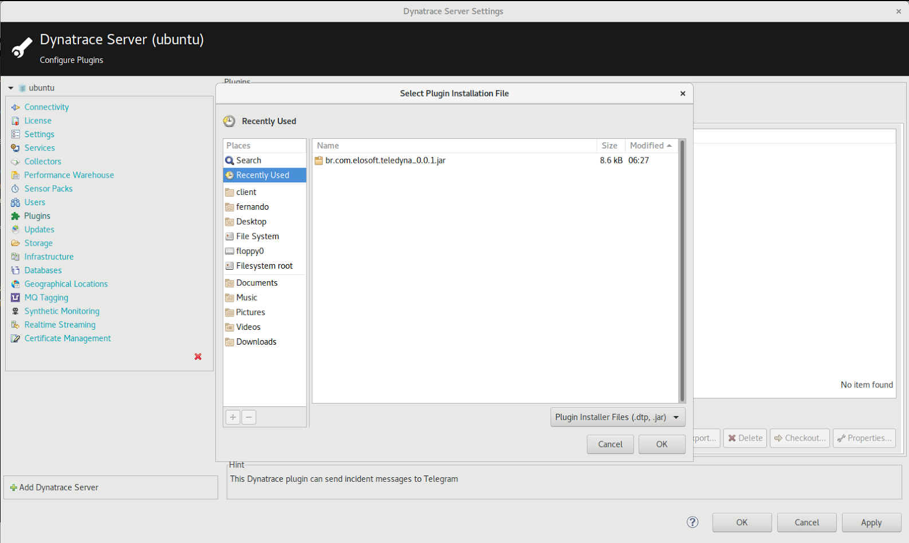
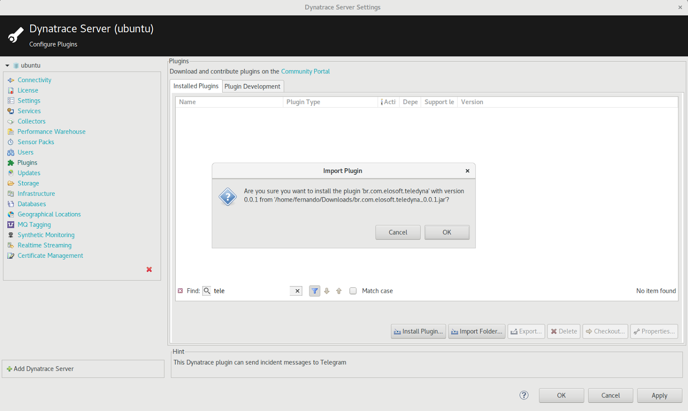
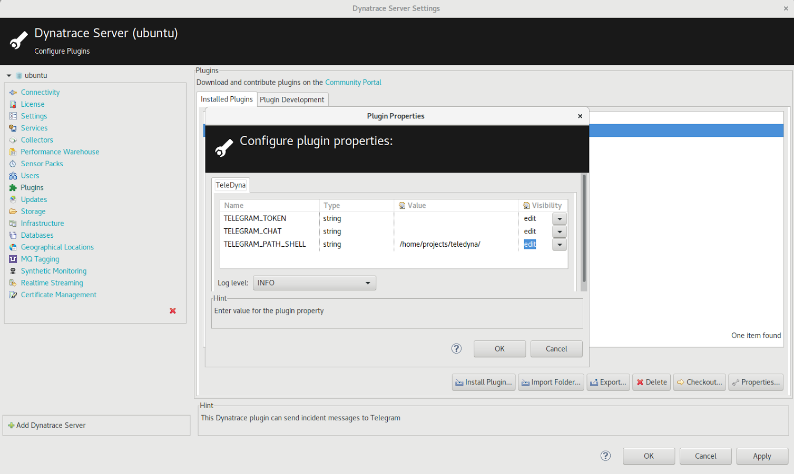
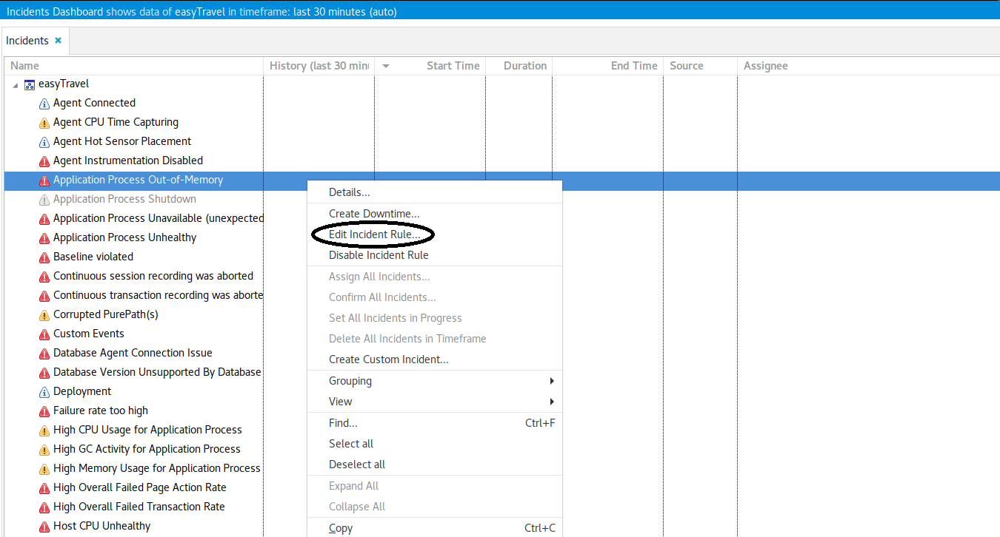
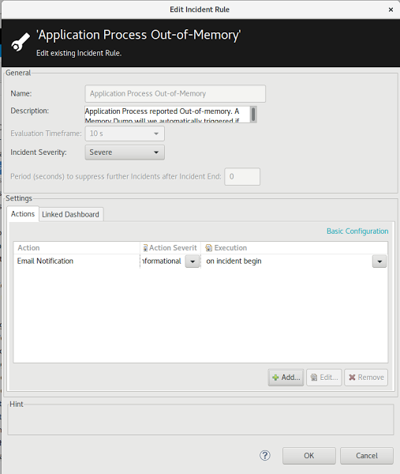
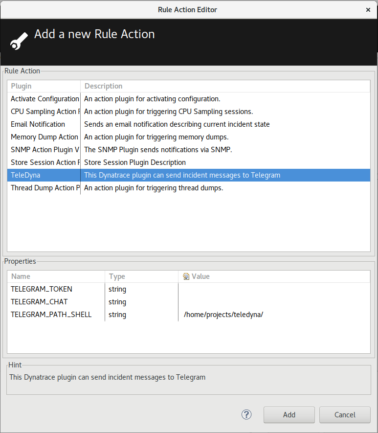
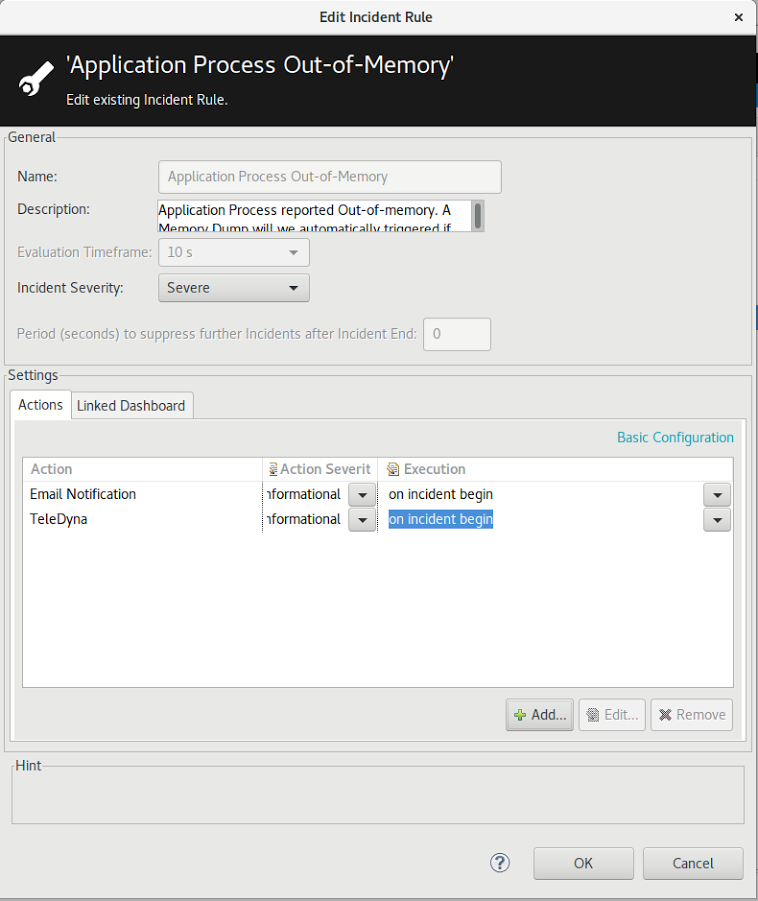
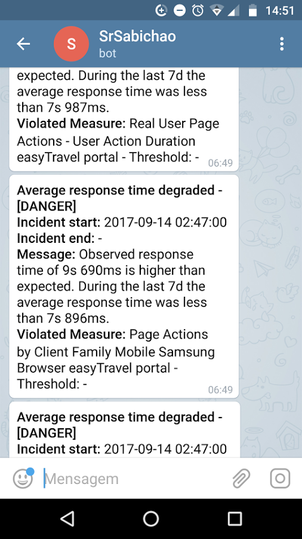

# TeleDyna - Dynatrace AppMon Plugin

    

## Introduction

Based on the [SlackChat plugin][df2], TeleDyna was created, a plugin to integrate the incidents of Dynatrace AppMon with [Telegram][df7]. Find further information in the [Dynatrace community][df1].

## Special Thanks:

> https://github.com/fabianonline/telegram.sh
>
> https://github.com/Dynatrace/Dynatrace-AppMon-Slack-Integration-Plugin 

## Plugin Details

| Plugin | README |
| ------ | ------ |
| Plug-In Files | dynaTrace 7: [TeleDyna 0.0.1][df5] |
| Author | Fernando Lewandowski Albuquerque - fernando@elosoft.com.br / fernando.lewandowski@gmail.com |
| DynaTrace AppMon Versions | 7.x |
| Operational System | Linux ubuntu 4.10.0-33-generic #37-Ubuntu SMP Fri Aug 11 10:55:28 UTC 2017 x86_64 x86_64 x86_64 GNU/Linux |
| License | [dynaTrace BSD][df4] |
| Support | [Not Supported][df3] |
| Known Problems | --- |

## Requirements

- Only bash and curl. Listing known chats with -l requires jq, but you can easily use this tool without this.
```sh
$ sudo apt-get install jq
```
- Grab the latest telegram file from this repository and put it somewhere ([Telegram.sh][df6]).
- Give execution permission to the shell
```sh
$ chmod +x telegram.sh
```
- Create a bot at telegram:

| bot at telegram |
| ------ |
| Search for the user @botfather at telegram and start a chat with him. |
| Use the /newbot command to create a new bot. BotFather will give you a token. Keep this. |

- Use your telegram client to send a message to your new bot. Any message will do.
- Find your chat id. Run telegram.sh with -l: 
```sh
$ telegram -t <TOKEN> -l
```
If you have jq installed, it will nicely list its known chats. The number at the front is your chat id. If you don't have jq installed, it will print a bit of JSON data and tell you what to look for. These are the available chats that I can find right now. The ID is the number at the front. If there are no chats or the chat you are looking for isn't there, run this command again after sending a message to your bot via telegram.
- You now have your token and your chat id. Send yourself a first message: 
```sh
$ telegram -t <TOKEN> -c <CHAT ID> "Hello there."
```

## Installation

* Download the plugin in [TeleDyna 0.0.1][df5] 

[](assets/001.png)

* Confirm plugin installation

[](assets/002.png)

* Inform the Token, Chat ID and directory where the telegram.sh shell is located (If in doubt, see Topic 3. Requirements). In this regard, you will not need to report again.

[](assets/003.png)

* Elect an incident to be triggered with the TeleDyna plugin

[](assets/004.png)

* Go to the "Actions"

[](assets/005.png)

* Choose the TeleDyna plugin. If the configuration has not been done in step 4.C, do so now, informing the Token, Chat ID and directory where the telegram.sh shell is located (If in doubt, see Topic 3. Requirements). Click "Add".

[](assets/006.png)

* Click "OK"

[](assets/007.png)

* Once an incident is generated and has been previously configured with a TeleDyna action, a message will be sent to the indicated chat, as shown below:

[](assets/008.png)

## Todos

 - Write More Tests
 - Proxy Support
 - Filter Options

   [df1]: <https://community.dynatrace.com/community/display/DL/Telegram+Plugin>
   [df2]: <https://github.com/lewandowski/Dynatrace-AppMon-Slack-Integration-Plugin>
   [df3]: <https://community.dynatrace.com/community/display/DL/Support+Levels>
   [df4]: <https://community.dynatrace.com/community/download/attachments/5144912/dynaTraceBSD.txt?version=3&modificationDate=1441261477160&api=v2>
   [df5]: <https://github.com/Dynatrace-AppMon-Telegram-Plugin/TeleDyna/blob/master/build/br.com.elosoft.teledyna_0.0.1.jar?raw=true>
   [df6]: <https://raw.githubusercontent.com/Dynatrace-AppMon-Telegram-Plugin/TeleDyna/master/telegram.sh>
   [df7]: <https://telegram.org/>
